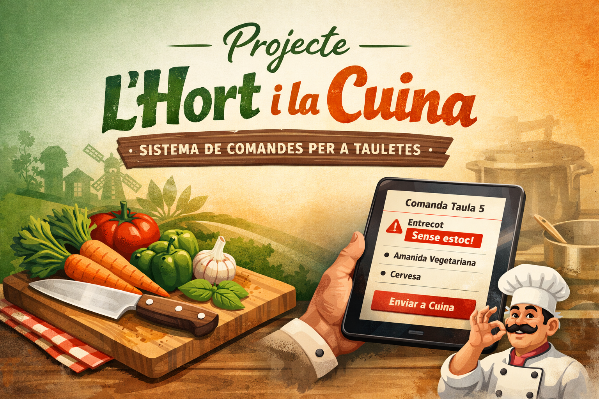

Activitat avaluable de la UF09 on es dissenya i implementa un sistema de gestió d’un restaurant aplicant els conceptes treballats a classe.

# Projecte: L’Hort i la Cuina (sistema Beta)

## Brief del client

**De:** Miquel Roca (Director d’Operacions – Grup de Restauració *L’Hort i la Cuina*)  
**Per a:** Equip de Desenvolupament (Junior Developers)  
**Assumpte:** Beta urgent – Motor lògic del sistema de comandes per a tauletes

Hola equip,

Estem fent el salt definitiu a tauletes als nostres restaurants i necessitem tindre operatiu el **nucli del sistema de comandes** com més prompte millor. La part visual ja la tenim encaminada, però ara mateix ens falta el que realment fa que el sistema funcione: **les classes de Java que modelen els productes, les comandes i el càlcul dels imports**.

El nostre arquitecte ha preparat l’arxiu **`App.java`** per a provar la beta i, més endavant, connectar-ho amb una base de dades. **Aquest fitxer no es pot tocar**. El vostre treball és construir tot el que falta perquè aquest `Main` puga executar-se sense cap error.

### El que necessitem que el sistema suporte en aquesta versió beta

- **Catàleg de productes.** Al restaurant gestionem productes, especialment **plats principals** i **begudes**. Tot producte ha de tindre com a mínim **un nom** i **un preu base**, i el sistema ha de poder tractar-los de manera coherent.

- **Càlcul del preu final.** Quan es cobra, l’assessoria ens obliga a aplicar **IVA** segons el tipus d’article (10% per a plats i 21% per a begudes). Per tant, necessitem poder obtindre el **preu final** d’allò que es factura, i que el programa puga fer aquest càlcul de forma fiable.

- **Etiquetes de dietes i al·lèrgens.** Sanitat és molt estricta amb nosaltres. Hi ha productes que s’han de poder identificar ràpidament com a especials per dieta: **vegetarià** i **sense gluten** (en concret, cap de les nostres begudes conté gluten). No cal que això tinga funcionalitats complicades; però el sistema ha de poder reconéixer-ho quan siga necessari.

- **Gestió de comandes per taula.** Cada comanda està associada a un **número de taula** i conté una **llista de productes** que el cambrer va afegint.

- **Control d’estoc en enviar a cuina.** Quan el cambrer “envia” la comanda, el sistema ha de comprovar si hi ha algun element que **no està disponible** i avisar perquè el cambrer puga reaccionar (o canviar el producte) i continuar treballant.  
  Per a aquesta beta, **simularem un cas real d’estoc**: si en la comanda apareix un producte que conté la paraula **“entrecot”** en el nom, el sistema ha d’avisar que **no queda entrecot** (per exemple: “No tenim estoc d’entrecot” o un missatge equivalent).

## Restriccions

- **Prohibit modificar** `App.java`.
- Heu de crear els fitxers i elements necessaris amb els **noms esperats** perquè el `Main` els puga trobar i usar.
- El projecte ha de **compilar i executar** en un entorn Java estàndard.

## Lliurable

- Tots els fitxers `.java` creats per vosaltres (estructura completa del projecte excepte el `Main` proporcionat).
- Projecte executable on, en fer *Run* sobre `App.java`, funcione sense errors.

##  Objectius
1.  Aplicar **Herència** i **Classes Abstractes**.
2.  Implementar **Interfícies** (de mètode i marcadores).
3.  Gestionar **Excepcions personalitzades** (Runtime).
4.  Treballar amb **Polimorfisme** i llistes dinàmiques.

##  Estructura del Projecte
Totes les classes han d'estar dins del paquet `main.restaurant` (carpeta `src/main/java/main/restaurant/`).

## 📈 Avaluació
El projecte s'avalua automàticament al fer `push`. La nota es calcula segons els tests passats:
- **Herència i Abstracció**: 2 punts.
- **Interfícies i Marcadors**: 2 punts.
- **Càlcul d'IVA**: 2 punts.
- **Gestió d'Excepcions**: 2 punts.
- **Polimorfisme i Lògica**: 2 punts.

> ATENCIÓ: Per a que s'executen els tests serà necessari que el projecte compile correctament. Sinó rebrà una puntuació automàtica de 0 punts-
- **Projecte sense compilar**: 0 punts.

---
💡 **Consell:** Executa `mvn test` en el teu terminal abans de pujar el codi per a comprovar la teua nota.
